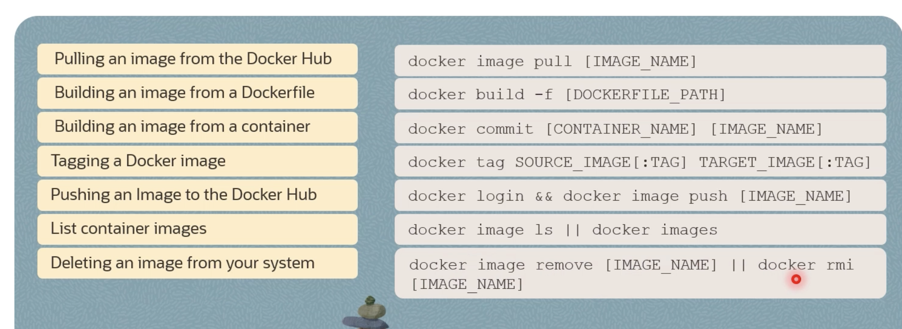
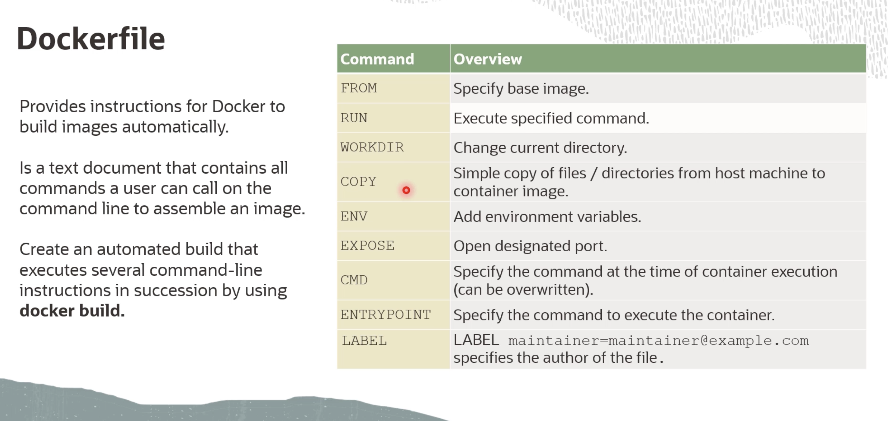

--Docker
docker run hello-world

docker images 

#shows the running container
docker ps
docker ps -a

docker rm containerID #removes the docker image

docker run -it busybox sh # gives a linux terminal

docker run -d -p 80:80 docker/getting-started #creates a container and maps the port 80 of machine to docker image

curl http://127.0.0.1:80 # using port 80 and this redirects to the docker 

docker stop/start/restart <containerID>

docker port <Container ID> #shows which port it is mapped to

docker logs <Container ID> #shows the container logs

docker inspect <Container ID>  # the machine/container information

docker top <Container ID>  #Process running inside the container

docker exec -it <Container ID> #executes command inside the container

--Docker File
